恶意代码分析实战
Lab 1-1
1. 将文件上传至http://www.VirusTotal.com/进行分析报告。文件匹配到了已有的反病毒软件特称吗?
lab1-1.exe反病毒特称报告
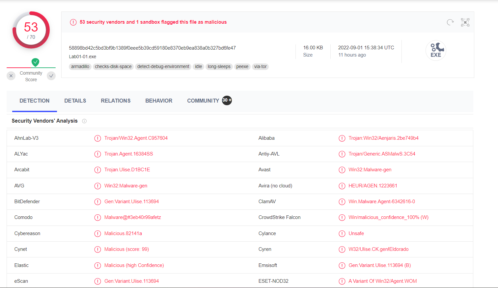
lab1-1.dll反病毒特称报告
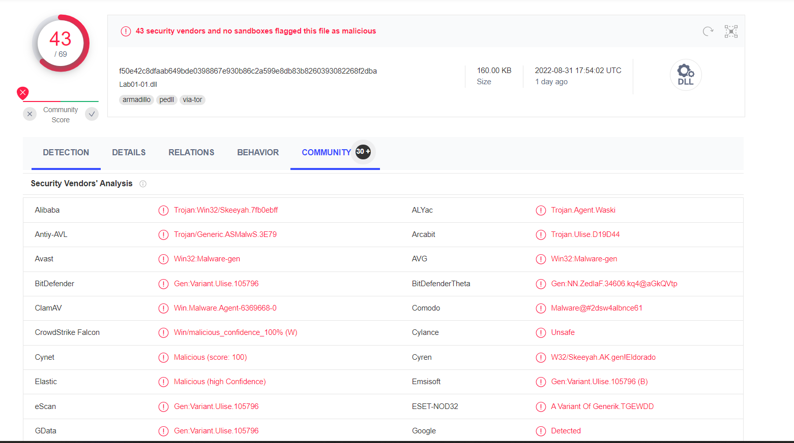

2. 这些文件是什么时候编译的？
查看IAGE_NE_HEADERS>IMAGE_FILE_HEADER下的时间戳可观查到。但本人下载的peview版本无法查看时间戳。
在Dependaency Walker中可发现其为2012-1-8 2：19

3. 这两个文件总是否存在迹象说明它们是否被加壳或混淆了？如果是，这些迹象在哪？
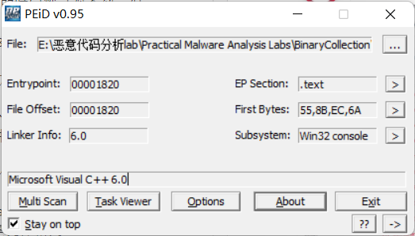
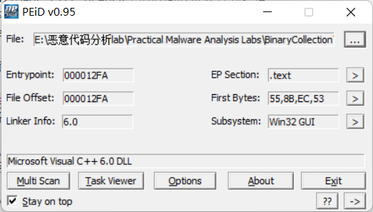
根据PEiD工具可以看出exe和dll文件并未被加壳或混淆;根据在peview上比较各个分节的虚拟大小（Virtual Size）和原始数据大小（Size of Raw Data）,发现这两个文件的虚拟大小均与实际数据大小大致相同，说明没有被加壳或混淆。
4. 是否又导入函数显示出了这个恶意代码是做什么的？如果是，是那些导入函数？
Lab1-1.exe中发现导入函数CreateFileA,CreateFileMappingA,FindFirstFileA,FindNextFileA。说明与创建文件相关。

Lab1-1.dll中有Sleep,CreateProcessA函数会创建一个进程。并引入了Ws2_32.dll(这是个联网DLL，访问非常可能连接网络或执行网络相关的任务)

5. 是否有任何其他文件或基于主机的迹象，让你可以在受感染系统上查找？
可以看到该程序想在system中庸kerne132.dll来混淆原系统中的kernel32.dll程序。
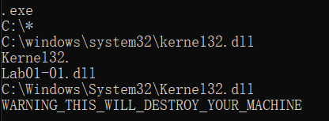
6. 是否有基于网络的迹象，可以用来发现受感染机器上的这个恶意代码？
前门提到Lab01-01.dll文件可能与网络程序相关，用Strings程序提取字符串可以看到一个ip地址，猜测可能是之后连接的地址。
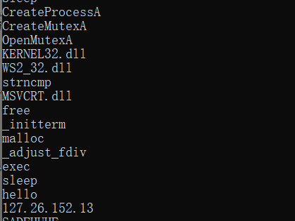
7. 你猜这些文件的目的是什么？
dll文件是一个后门，exe文件用于执行dll文件。

Lab1-2
1.将Lab01-02.exe文件上传至http://www.VirusTotal.com/进行分析并查看报告。文件匹配到了已有的反病毒软件特征吗？

在网站上总共有56个反病毒软件匹配到了特征，查看细节发现该exe程序编译于2011-01-19.在Section部分发现看不到.data,.text等分节，发现被upx进行加壳处理。然后引入了ADVAPI32.dll(该dll提供了对核心Windows组件的访问，如服务管理器和注册表)；WINNET.dll(包含了更高层次的网络函数，如FTP,HTTP,NTP)和kernel32.dll。

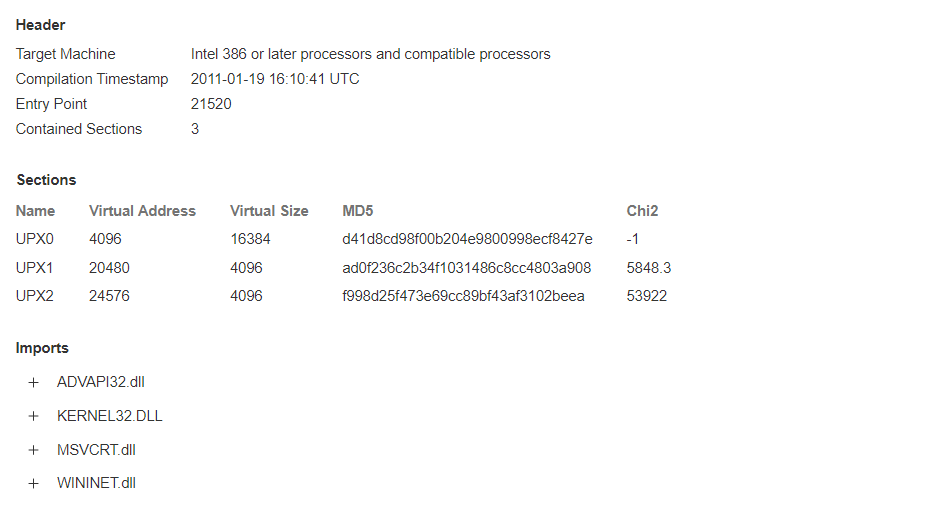

2.是否有这个文件被加壳或混淆的任何迹象？如果是这样，这些迹象是什么？如果该文件被加壳，请进行脱壳，如果可能的话。

使用PEiD发现exe被加壳处理。
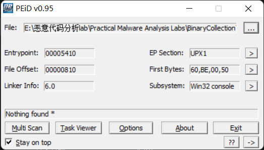
使用upx对该exe进行脱壳，如下图所示。

3.有没有任何导入函数能够暗示出这个程序的功能？如果是，是那些导入函数，它们会告诉你什么吗？
exe引入了winnet.dll引入了InternetOpenUrlA函数，说明使用互联网打开一个url。

exe引入了advapi.dll引入了CreateServiceA函数，说明会创建一个服务。

4.哪些基于主机或基于网络的迹象可以被用来确定被这个恶意代码所感染的机器？
使用strings程序扫描字符串发现“MalService”和“http://www.malwareanalysisbook.com”。“MalService”可能是创建的服务名称。网址可能是想连入的一个网址。
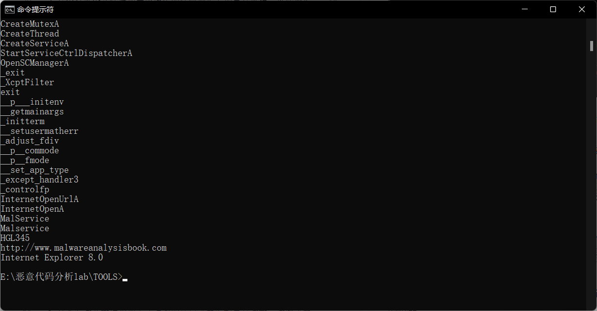

Lab1-3
1.将Lab01-03.exe文件上传至http://www.VirusTotal.com/进行分析并查看报告。文件匹配到了已有的反病毒软件特征吗？

有63中反病毒软件匹配到特称。secttions的名称都是无意义的判断肯加了壳，且显示只引入了kernel.dll。
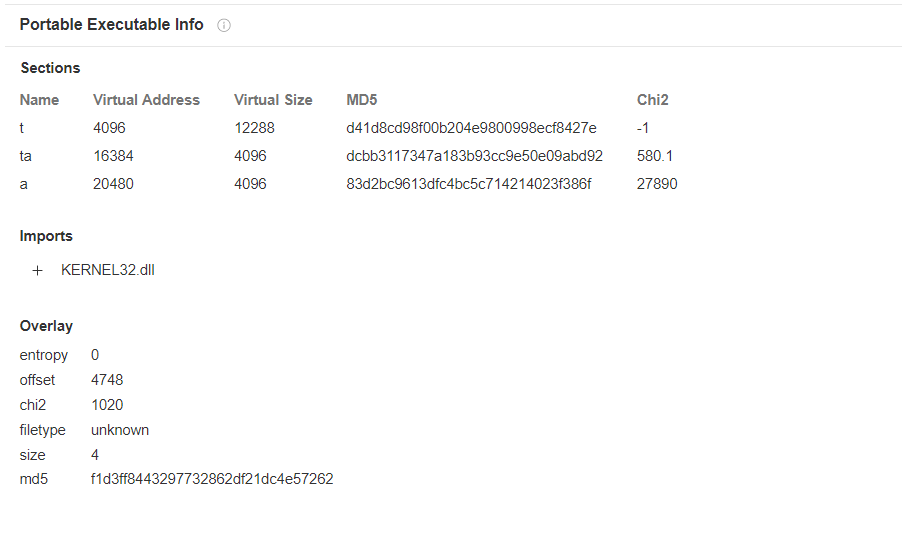
2.是否有这个文件被加壳或混淆的任何迹象？如果是这样，这些迹象是什么？如果该文件被加壳，请进行脱壳，如果可能的话。

exe使用FSG1.0进行加壳处理。
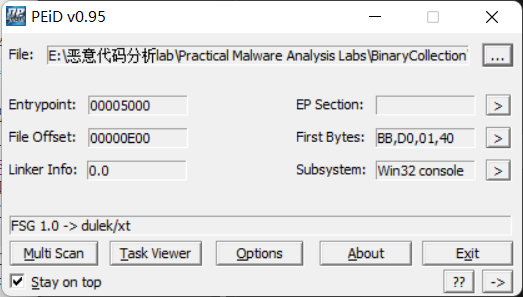
现在还无法脱壳
3.有没有任何导入函数能够暗示出这个程序的功能？如果是，是那些导入函数，它们会告诉你什么吗？
由于加壳无法查看
4.有哪些基于主机或基于网络的迹象，可以被用来确定被这个恶意代码所感染的机器？
由于加壳无法查看

Lab1-4
1.将Lab01-03.exe文件上传至http://www.VirusTotal.com/进行分析并查看报告。文件匹配到了已有的反病毒软件特征吗？
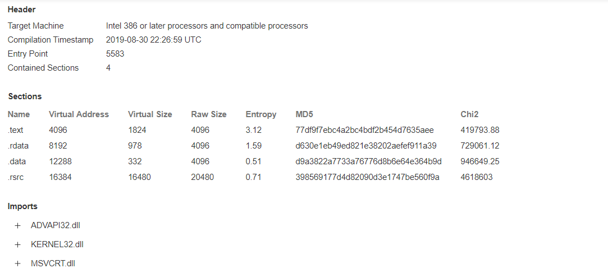
2.是否有这个文件被加壳或混淆的任何迹象？如果是这样，这些迹象是什么？如果该文件被加壳，请进行脱壳，如果可能的话。
使用PEid程序发现exe未被加壳。
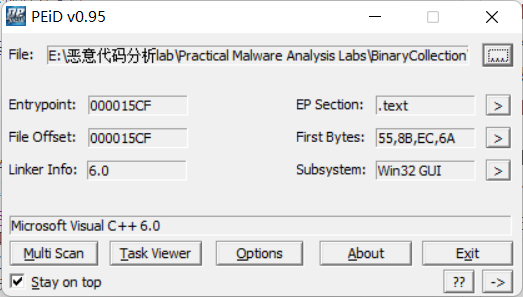
3.这个文件是什么时候被编译的?

1中可知该文件在2019-08-30号被编译的。

4.有没有任何导入函数能够暗示出这个程序的功能？如果是，是那些导入函数，它们会告诉你什么吗？

使用Dependency Walke发现kernel.dll中引入FindResourceA,LoadResource,SizeofResource用来加载一些资源；引入CreateFileA,WriteFile用来创建写入文件；引入WinExec用来在执行磁盘上的一个文件；引入GetWindowsDirectoryA可能访问写入到了系统目录。

5.有哪些基于主机或基于网络的迹象，可以被用来确定被这个恶意代码所感染的机器？

使用strings扫描exe，发现可能从目标url http://www.practicalmalwareanalysis.com/updater.exe/ 下载资源并wupdmgrd.exe入到系统目录中。但目前还没查看到它引入任何访问网络的函数

6.这个文件在资源段中包含一个资源。使用Resource Hacker工具来检查资源，然后抽取资源。从资源中你能发现什么吗？

发现恶意代码将一个程序嵌入到资源节中，在程序运行之前，它们会将嵌入可执行文件提取出来。分析提取出来的程序，发现他从URLMON.dll中引入了网络函数URLDownloadToFileA函数通过访问url下载文件。
